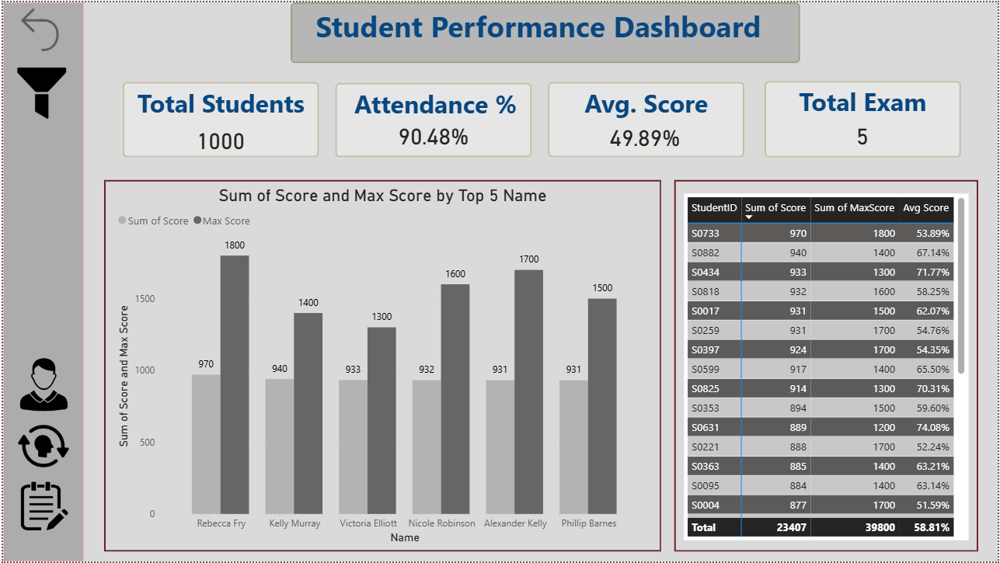
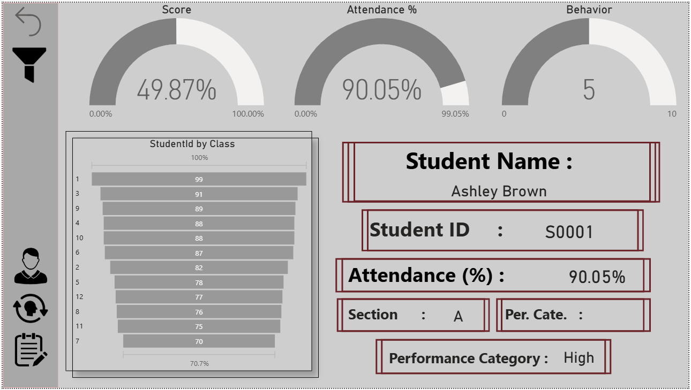
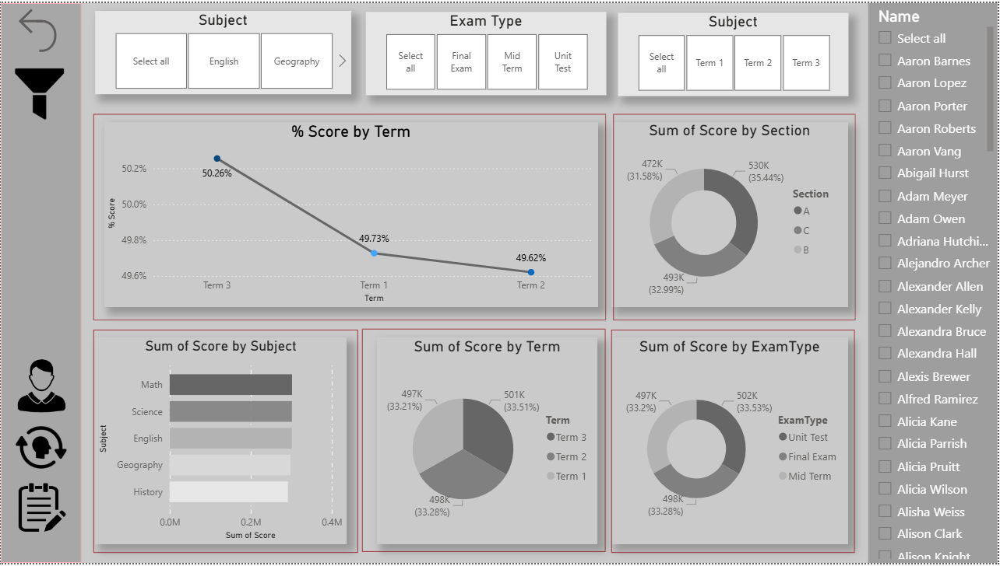
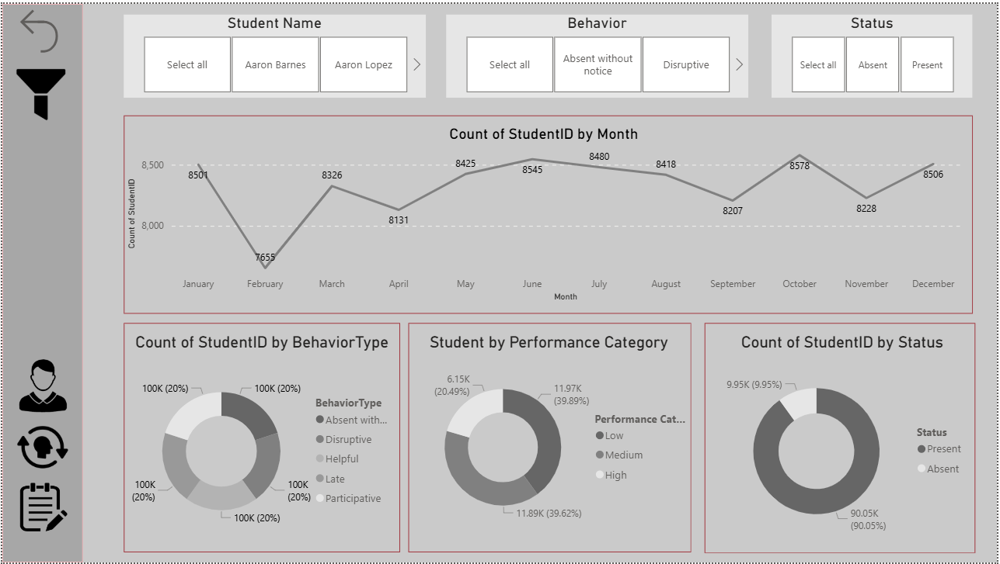

from pypandoc import convert_text

content = r"""
# 📘 Student Performance Dashboard – Academic & Behavioral Insights

### 🔗 Live Dashboard: 
#### https://app.powerbi.com/view?r=eyJrIjoiYWQxYjdiM2EtNDIzMi00NjZlLTkzZjYtM2QwNDU0ZTk0NjFkIiwidCI6ImNmZDY4M2U1LTc5YWItNDc3Yy1hODE4LWNkNTRmZjIxMmE4ZiJ9 
--- 

## 🔎 Overview

- ✅ Analyze academic scores  
- ✅ Track attendance  
- ✅ Evaluate behavior patterns  
- ✅ Support data-driven decisions

This dashboard provides a unified view of student academic and behavioral performance using Power BI and DAX.

---

## 🔷 Problem Statement

- Institutions lack combined academic + behavior insights  
- Attendance impact not clearly visible  
- Student progress tracking is complex  
- Behavior logs remain unused

---

## ✅ Features

- ✔ Interactive slicers for Class, Section, Subject, Term  
- ✔ Student-wise profiling  
- ✔ Trend analysis by term  
- ✔ Attendance percentage  
- ✔ Behavior distribution  
- ✔ Conditional formatting  
- ✔ Bookmark navigation  
- ✔ Drillthrough student page

---

## 🛠 Tech Stack

- 📊 Power BI Desktop  
- 🧮 DAX  
- 🗄 CSV / Excel  
- 🔗 Data Modeling  
- 📐 Storytelling

---

## 🖼 Dashboard Screenshots

  
  

---

## 💡 Insights Generated

- 📌 Subject performance by class  
- 📌 Low attendance vs score  
- 📌 Behavior count  
- 📌 Term improvement  
- 📌 Intervention cases

---

## 📂 Dataset Details

1. Students.csv – StudentID, Name, Gender, Class, Section  
2. Scores.csv – StudentID, Subject, ExamType, Score, MaxScore, Term  
3. Attendance.csv – StudentID, Date, Status, Reason  
4. Behavior.csv – StudentID, Date, Behavior Type, Notes

---

## 🧮 DAX Measures

- % Score = Score / MaxScore  
- Average Score per Subject  
- Attendance %  
- Behavior Count  
- Performance Category

---

## 🚀 Installation / Usage

1. Install Power BI Desktop  
2. Open .pbix file  
3. Refresh data paths  
4. Explore with slicers  
5. Publish to Service

---

## 🔮 Future Enhancements

- 📱 Mobile layout  
- 🤖 Predictive analytics  
- 🔐 RLS security  
- 🔄 Auto CSV sync

---

## 🤝 Connect With Me

If you found this project useful or would like to collaborate:

- 💼 **LinkedIn:** https://www.linkedin.com/in/ayush-isamaliya-686533312/
- 📧 **Email:** aisamaliya8@gmail.com

---

